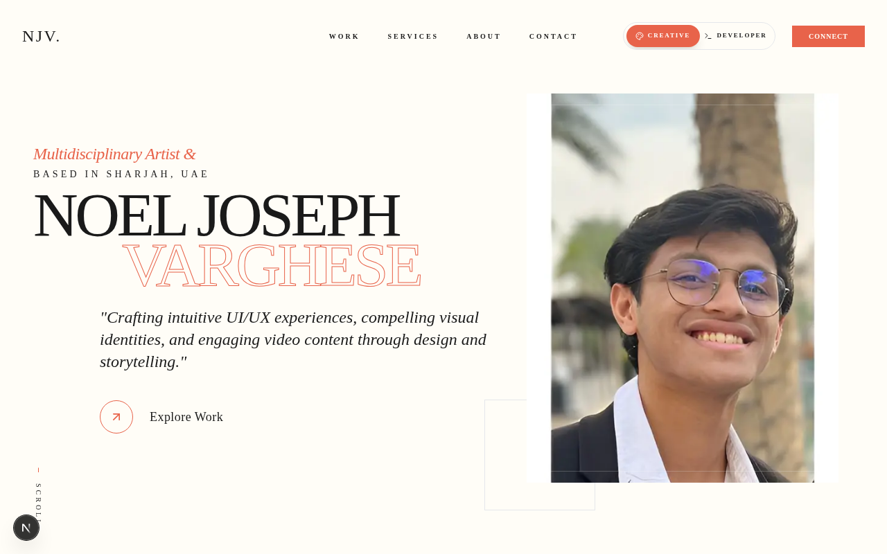
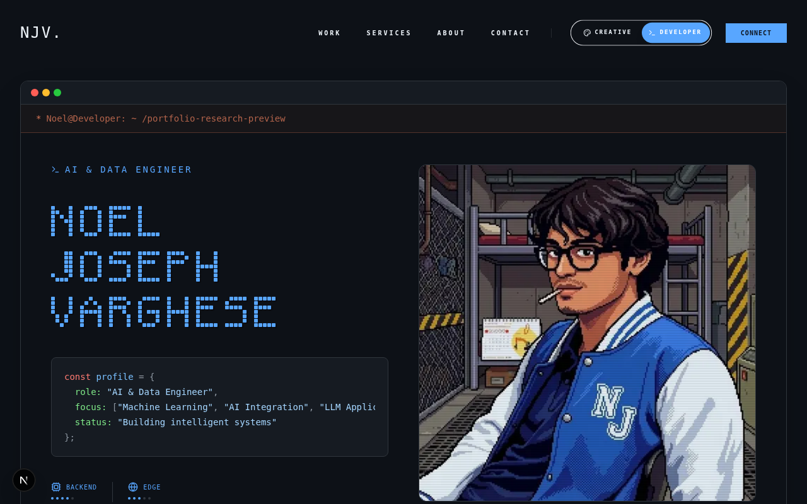
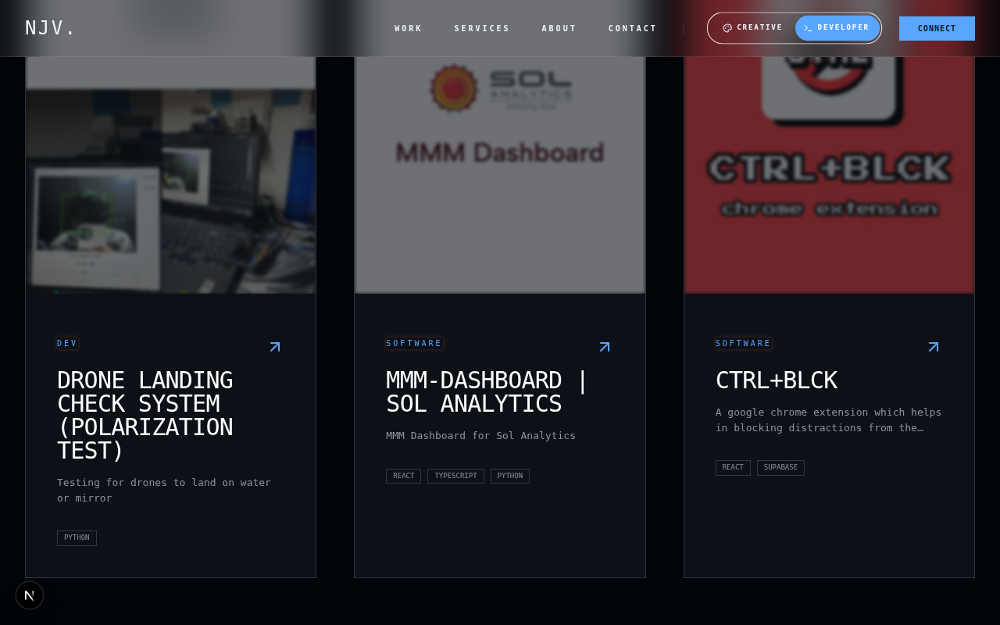

# Noel Joseph Varghese | Dual-Identity Portfolio

Welcome to my personal portfolio. I am a **Multidisciplinary Artist** and **AI & Data Engineer** based in Sharjah, UAE. This website is a reflection of my dual nature—seamlessly merging the precision of engineering with the boundless expression of art.

## 🌗 The Concept: Creative x Developer

This portfolio is built around a "Mode Toggle" that fundamentally shifts the site's identity, reflecting the two halves of my professional life.

- **Creative Mode**: Designed for the multidisciplinary artist. It features cinematic visuals, bold display typography, and a fluid, immersive experience.
- **Developer Mode**: Tailored for the AI & Data Engineer. It uses a terminal-inspired aesthetic, mono-spaced fonts, and structured data layouts to showcase technical proficiency.

## 📸 Visual Showcase

### Creative Mode
*The artistic side: high-impact visuals and cinematic storytelling.*


### Developer Mode
*The technical side: terminal vibes and structured engineering insights.*


### Projects & Exploration
*A unified grid showcasing work across both disciplines.*


## 🛠️ Tech Stack

- **Framework**: [Next.js 16](https://nextjs.org/) (App Router)
- **Animations**: [Framer Motion](https://www.framer.com/motion/) for smooth state transitions between modes.
- **Styling**: [Tailwind CSS](https://tailwindcss.com/) for a responsive and highly customized UI.
- **Icons**: [Lucide React](https://lucide.dev/)
- **State Management**: React Context API for the global mode toggle.

## 🚀 Local Development

Follow these steps to get the project running on your machine:

1. **Clone the repo:**
   ```bash
   git clone <your-repo-url>
   ```

2. **Install dependencies:**
   ```bash
   npm install
   ```

3. **Run the development server:**
   ```bash
   npm run dev
   ```

4. **View the site:**
   Open [http://localhost:3000](http://localhost:3000) in your browser.

## 📬 Let's Connect

Whether you have a vision for a cinematic project or a complex technical challenge, I'm ready to bring my dual-identity expertise to the table.

- **Email**: [noeljosephvarghese@gmail.com](mailto:noeljosephvarghese@gmail.com)
- **Location**: Sharjah, UAE

---
© 2026 Noel Joseph Varghese. Built with passion at the intersection of Code and Art.
